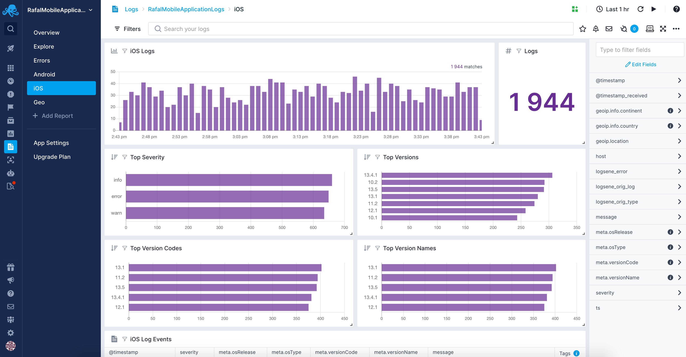

[logsene]: https://sematext.com/logsene/
[register]: https://apps.sematext.com/ui/registration
[hosted-kibana]: https://sematext.com/docs/logs/kibana/
[video-tutorials]: https://www.elastic.co/blog/kibana-4-video-tutorials-part-1

SDK for Shipping iOS Application Logs to Sematext
=============================

[](https://travis-ci.org/sematext/sematext-logsene-ios)
[](http://cocoapods.org/pods/Logsene)
[](http://cocoapods.org/pods/Logsene)
[](http://cocoapods.org/pods/Logsene)

[Sematext Logs is ELK as a Service][logsene]. This library lets you collect **mobile analytics** and **log data** from your iOS applications using Sematext. There is an equivalent library for [shipping logs from Android](https://github.com/sematext/sematext-logsene-android) available. If you don't have a Sematext account, you can [register for free][register] to get your App token.

Use the **Mobile Application Logs** Integration to get out-of-the-box reports with the most important information about your mobile applications.

Get an overview of your mobile apps with information like:
 - top iOS versions
 - top log severities and version names


Explore the common errors associated with your mobile applications and see an aggregated error view including:
 - number of errors and theirs count over time
 - top operating systems, top iOS versions that are reporting errors
 - error log events


Get insights from dedicated iOS report that include:
 - mobile operating system logs count histogram and their count
 - top severities, versions, version codes, and version names
 - mobile applications log events



Getting Started
---------------

1. Logsene log shipping library for iOS is available through [CocoaPods](http://cocoapods.org). To install it, simply add the following line to your Podfile:

```ruby
pod "Logsene"
```

2. Run `pod install`
3. Call `LogseneInit()` from your application delegate in `didFinishLaunchingWithOptions:`. For example:

```swift
@UIApplicationMain
class AppDelegate: UIResponder, UIApplicationDelegate {
    var window: UIWindow?

    func application(application: UIApplication, didFinishLaunchingWithOptions launchOptions: [NSObject: AnyObject]?) -> Bool {
        try! LogseneInit("<yourtoken>", type: "example")
    }
}
```

You can optionaly provide the `receiverUrl` parameter if you are using [Sematext Enterprise](https://sematext.com/enterprise), and `maxOfflineMessages` to configure how many messages are stored while device is offline (5,000 by default).

**Note**: We highly recommend creating a write-only token in your application settings for use in your mobile apps.

Example Application
-------------------

You can try out the example application with Cocoapods:

```bash
cd ~/Desktop
pod try Logsene
```

Make sure to set your own application token in `AppDelegate.swift`.

Mobile Application Analytics
----------------------------

You can collect application analytics using Sematext. To do that, use the `LLogEvent()` function to send custom events. For example, you might want to send an event each time the user completes a game level:

```swift
LLogEvent(["event": "level_completed", "message": "Level 3 completed", "value": "3"])
```

To visualize the collected data, you would use the [integrated Kibana dashboard][hosted-kibana].

If you don't see the events in the dashboard immediately, note that this library sends data in batches to preserve the battery (every 60s), or if there are more than 10 messages queued up. Messages are saved while the device is offline, so you don't have to worry about losing any data.

When it comes to the structure of your events, you are free to choose your own, the above is just an example. You can use any number of fields, and you can use nested fields. Basically, any valid JSON object will work fine. Note that the library reserves the `meta` field for meta information (see below). If you set a value for this field when sending an event, no meta information will be included for that event.

Meta Fields
-----------

A few predefined meta fields are included in each event sent to Sematext. The fields are stored inside the "meta" field.

- versionName (app version string, eg. 1.0)
- versionCode (app build number, eg. 92)
- osRelease (iOS version, eg. 9.3.0)
- uuid (device identifier)
- OS type (iOS)

You can set your own meta fields with `LogseneSetDefaultMeta`. For example:

```swift
LogseneSetDefaultMeta(["user": "user@example.com", "plan": "free"])
```

Note that these meta fields are global, and will be attached to every event sent to Logsene.

Pausing & Resuming Logs Sending
----------------------------------------

The library can be instructed to stop sending logs on demand. To do that you need to call the following function:

```swift
LogsenePauseSendingLogs()
```

Logs sending can be resumed by calling the following function:

```swift
LogseneResumeSendingLogs()
```

Note that the logs that are in the buffer and were waiting to be sent at the time of pausing will not be sent until the logs sending process is resumed. 

Centralized Logging
-------------------

The library offers some basic functions for centralized logging:

- LLogDebug
- LLogInfo
- LLogWarn
- LLogError

Each function provides two variants - logging a message or error without and with the device location. 

Example of writing a log message:

```swift
DDLogInfo("hello world!")
```

Example of writing a log message with location data:

```swift
let location = LogsLocation(fromLatitude: 53.13, fromLongitude: 23.16)
LLogInfo(withMessage: "hello world with location!", withLocation: location)
```

#### Automatically enrich logs with location data on iOS

If you would like to allow the library to automatically enrich log data with the location data it is as easy as properly initializing the library, for example:

```swift
LogseneInit("<yourtoken>", type: "example", automaticLocationEnriching: true, useLocationOnlyInForeground: true)
```

There are two properties here:
 * **automaticLocationEnriching** - when set to true the library will try to enrich the logs with location information,
 * **useLocationOnlyInForeground** - when set to true the location will only be gathered when the application is in forground.
 
 In addition to setting up the **LogseneInit** properly you also need to ensure to include two additonal string values in the **Info.plist** file that will be diplayed when asking the user to allow location data to be gathered. Those aree:
 * **Privacy - Location Always and When In Use Usage Description** 
 * **Privacy - Location When In Use Usage Description**

**Automatic location enriching only works with iOS, not MacOS.** 

For integrating with existing logging frameworks, see below.

### CocoaLumberjack

If you're using CocoaLumberjack for logging, you can use the custom Logsene logger to send log messages to Sematext automatically. You should configure CocoaLumberjack to use the Logsene logger:

```swift
@UIApplicationMain
class AppDelegate: UIResponder, UIApplicationDelegate {
    var window: UIWindow?

    func application(application: UIApplication, didFinishLaunchingWithOptions launchOptions: [NSObject: AnyObject]?) -> Bool {
        // NOTE: Set your token below
        try! LogseneInit("<yourtoken>", type: "example")

        // Here we setup CocoaLumberjack to log to both XCode console and Logsene
        DDLog.addLogger(DDTTYLogger.sharedInstance())
        DDLog.addLogger(LogseneLogger())
        DDLogInfo("hello world from CocoaLumberjack!")
        return true
    }
}
```

LogseneLogger is not included in the pod, but you can find the [implementation here](Example/Logsene/Logger.swift). Feel free to use it in your own project.

### How to log unhandled exceptions

You can log any unhandled Foundation exceptions by defining your own uncaught exception handler. For example:

```swift
@UIApplicationMain
class AppDelegate: UIResponder, UIApplicationDelegate {
    var window: UIWindow?

    func application(application: UIApplication, didFinishLaunchingWithOptions launchOptions: [NSObject: AnyObject]?) -> Bool {
        // NOTE: Set your token below
        try! LogseneInit("<yourtoken>", type: "example")

        NSSetUncaughtExceptionHandler { exception in
            // log unhandled exception message
            LLogError(exception)
        }
        return true
    }
}
```
